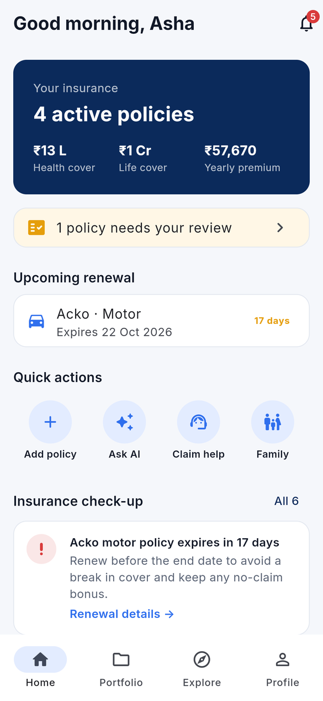
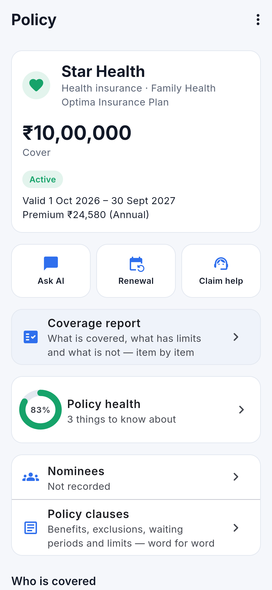
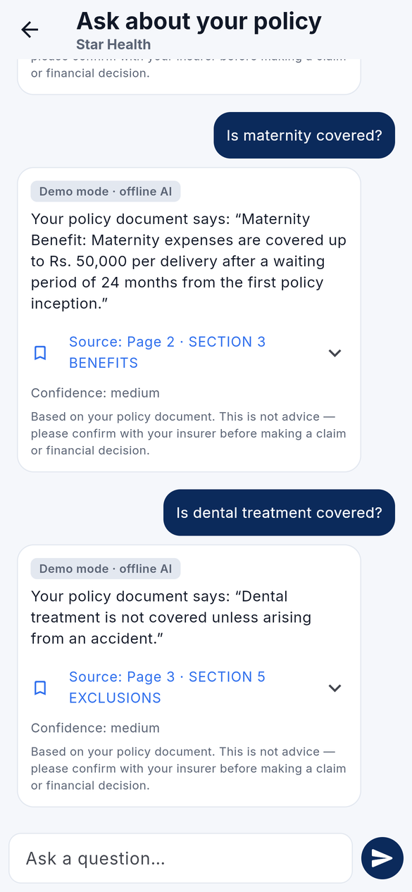
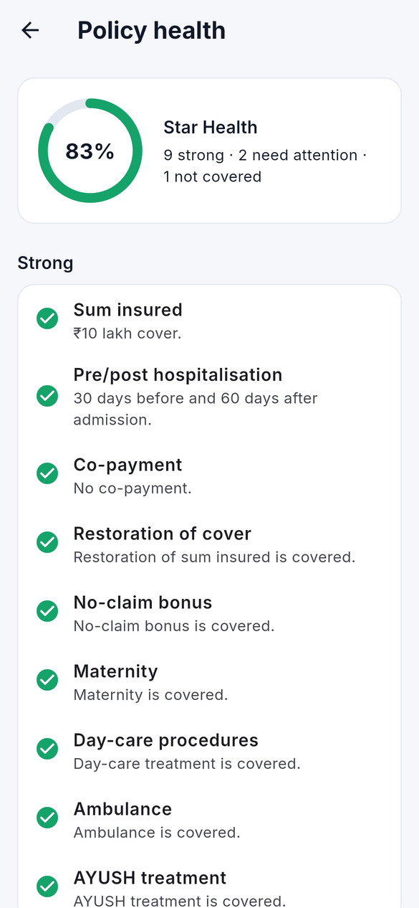
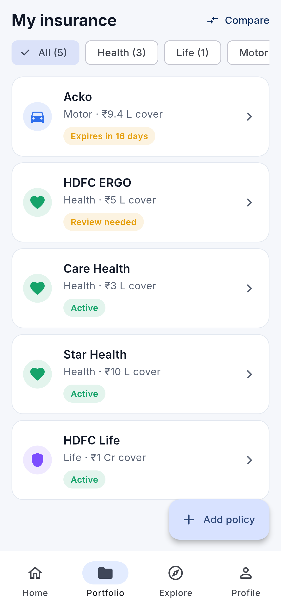
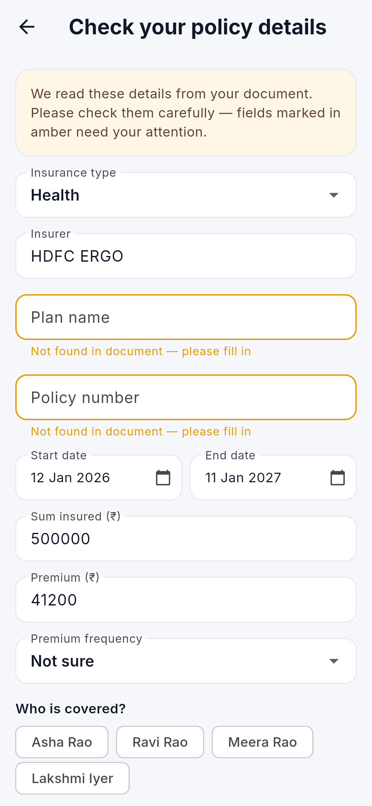
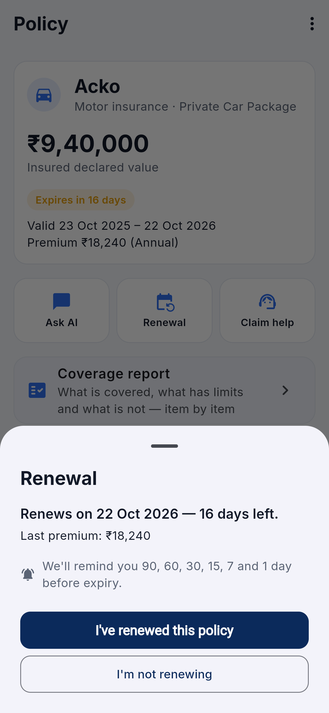
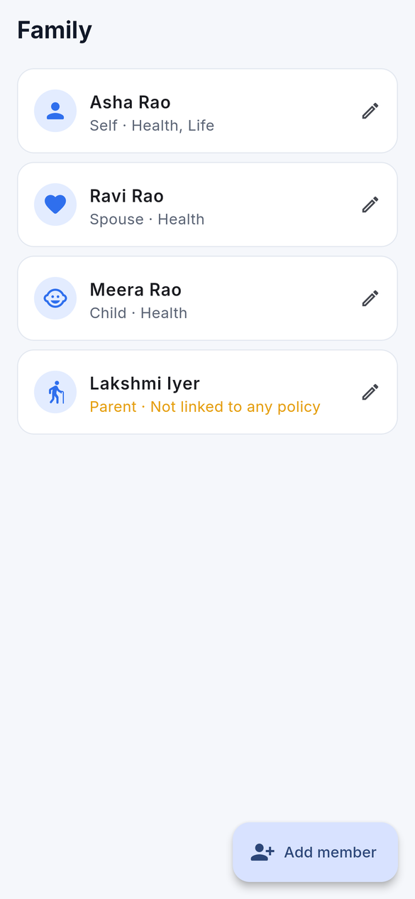

# InsureIQ — AI-powered personal insurance intelligence

> Working codename. Replace the name, bundle IDs (`com.insureiq.insureiq`) and branding before store submission.

A cross-platform (Android + iOS) app that lets people keep all their insurance policies in one place, understand what they are covered for, ask questions answered **from their own policy document**, and never miss a renewal.

V1 core loop: **Add policy → Read → Understand → Ask → Track → Renew**

| | |
|---|---|
| 📐 Technical blueprint (Phase 1) | [`docs/01-technical-blueprint.md`](docs/01-technical-blueprint.md) |
| 🗓️ 12-week roadmap (Phase 2) | [`docs/02-development-roadmap.md`](docs/02-development-roadmap.md) |
| 🎓 **New here? Beginner's guide** (install, run on your phone, daily workflow) | [`docs/03-beginner-guide.md`](docs/03-beginner-guide.md) |
| 🔭 Vision plan (5 phases → what is built / next / needs partners) | [`docs/04-vision-plan.md`](docs/04-vision-plan.md) |
| 🐍 Backend (FastAPI + PostgreSQL/pgvector) | [`backend/`](backend) |
| 📱 Mobile (Flutter, Android + iOS) | [`mobile/`](mobile) |

## Screenshots

| | | | |
|---|---|---|---|
|  |  |  |  |
|  |  |  |  |

All screens: [`docs/screenshots/`](docs/screenshots). They are captured from the Flutter web build at phone size against
the real backend in demo mode (offline mock AI, labelled "Demo mode · offline AI" in the app). Regenerate with
[`tools/demo/`](tools/demo/README.md).

## V1 feature status

| Area | Status |
|------|--------|
| Onboarding, phone OTP login, consent capture, profile | ✅ |
| Sessions: short-lived JWT + rotating refresh tokens with reuse detection, logout | ✅ |
| Add policy: PDF upload, photo upload, camera capture, manual entry | ✅ |
| Processing: PDF text / OCR, classification, AI extraction, grounding validation, per-field confidence, retry | ✅ |
| Verify & correct extracted details (low-confidence fields highlighted) | ✅ |
| Portfolio + home dashboard (coverage totals, renewals, insights) | ✅ |
| Policy detail, plain-language summary, document viewer (signed URLs) | ✅ |
| Ask AI — RAG with page citations, refuses when not in the document | ✅ |
| Policy health check — rules-based for health & motor | ✅ |
| Renewal tracking, "renewed / not renewing", reminders at 90/60/30/15/7/1 days | ✅ |
| Notifications: in-app inbox, push via FCM/APNs, preferences | ✅ (push needs your Firebase project) |
| Family members and "who is covered" per policy | ✅ |
| Claim guidance (health, motor, life) | ✅ static, reviewed content |
| App lock (biometric / device PIN) | ✅ |
| Help & FAQ, support requests, grievance officer | ✅ |
| Privacy: data export, account deletion with 7-day purge | ✅ |
| Admin operations dashboard (PII-masked) at `/admin` | ✅ (shared token; put behind SSO before scaling) |
| AI providers: Claude, OpenAI, Gemini, offline mock | ✅ (real providers need API keys; untested here) |
| **Nominees** per policy (shares, minor + appointee) and a family "if something happens" guide | ✅ |
| **Clause library** — policy wording split into benefits, exclusions, waiting periods, limits, conditions | ✅ rule-based, explainable |
| Related clauses shown under every AI answer | ✅ |
| **Insurance check-up** — product-neutral gap insights (missing cover, low family cover, nominees, renewals) | ✅ |
| **Compare** your own policies side by side | ✅ |
| AI answers & summaries in 9 Indian languages (Hindi tested) | ✅ app screens stay English for now |
| Own-AI foundations: PaddleOCR, self-hosted bge-m3 embeddings, ML worker image (Python 3.10.11) | ✅ code + tests; models not downloaded here |
| Exact version pins (`requirements.txt`, `requirements.lock`, `pubspec.lock`) | ✅ |
| Installable test APK built by GitHub Actions | ✅ Actions → *Android APK* |

### Needs your accounts / keys before launch

| Item | What to provide |
|------|-----------------|
| Real AI | `AI_PROVIDER=claude` + `ANTHROPIC_API_KEY` (or openai/gemini), `EMBEDDING_PROVIDER=openai` + `OPENAI_API_KEY` |
| SMS OTP | MSG91 account + DLT-approved template: `OTP_SENDER=msg91`, `MSG91_AUTH_KEY`, `MSG91_TEMPLATE_ID` |
| Push | Firebase project: backend `PUSH_SENDER=fcm`, `FCM_PROJECT_ID`, `FCM_SERVICE_ACCOUNT_JSON`; app `--dart-define=FIREBASE_*`; iOS: enable Push Notifications capability in Xcode + upload APNs key to Firebase |
| Storage | S3 / R2 bucket: `STORAGE_BACKEND=s3`, `S3_BUCKET`, (`S3_ENDPOINT_URL` for R2) |
| Legal URLs | `--dart-define=PRIVACY_URL / TERMS_URL / SUPPORT_EMAIL / GRIEVANCE_OFFICER` |
| Store identity | Replace the codename, bundle ID `com.insureiq.insureiq`, app icon |

The server refuses to start with `ENV=production` while any dev-only setting (mock AI, console OTP, local storage,
log push, in-memory rate limits) is still active.

## Run locally

### Backend

Requirements: Python 3.11, PostgreSQL 16 with pgvector, Tesseract (for scanned docs/photos). Easiest: `docker compose up -d` (Postgres + Redis).

```bash
cd backend
python3 -m venv .venv && .venv/bin/pip install -r requirements-dev.txt
cp .env.example .env              # dev defaults: mock AI, local storage, console OTP
.venv/bin/alembic upgrade head
.venv/bin/uvicorn app.main:app --reload --port 8000
# API docs: http://localhost:8000/docs   — OTP codes appear in this terminal's log
```

Tests (need a database `insure_test`, override with `TEST_DATABASE_URL`):

```bash
.venv/bin/pytest -q
.venv/bin/ruff check . && .venv/bin/ruff format --check .
```

Production-like processing uses Celery: set `TASKS_EAGER=false` and run
`celery -A app.workers.celery_app worker -l info` (+ `beat` for scheduled jobs).

### Mobile

Requirements: Flutter (stable), Android Studio / Xcode.

```bash
cd mobile
flutter pub get
flutter run                                   # Android emulator → http://10.0.2.2:8000, iOS sim → localhost
flutter run --dart-define=API_BASE_URL=https://api.staging.example.com/api/v1 --dart-define=ENV=staging
flutter analyze && flutter test
```

`mobile/web/` exists only for browser previews and screenshots; the product targets Android and iOS.

The app contains **no secrets** — only the public API URL.

## Architecture in one picture

```
Flutter app ──HTTPS/JWT──► FastAPI ──► PostgreSQL + pgvector
                              │
                              └─► Celery worker ─► Object storage (S3 / R2)
                                               ─► AI Gateway ─► Claude | OpenAI | (Gemini, local: future)
                                               ─► OCR (Tesseract → cloud OCR)
```

AI providers, embeddings, OCR, storage and OTP senders are all behind interfaces selected by environment variables, so vendors can be swapped without code changes.
